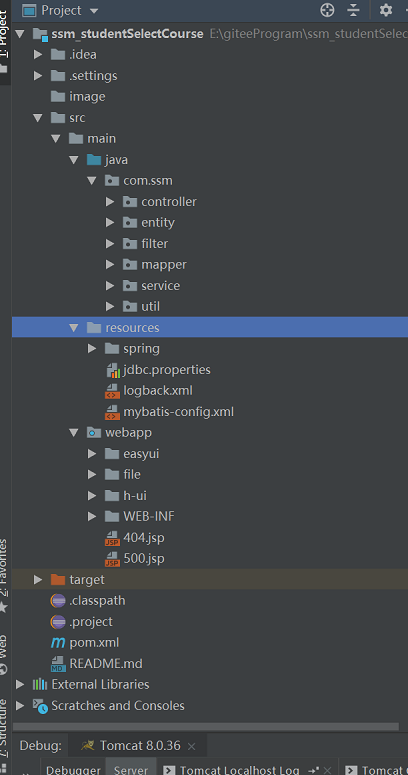
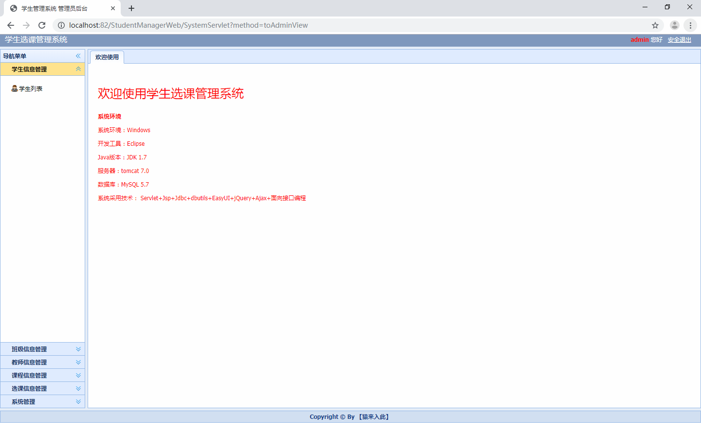
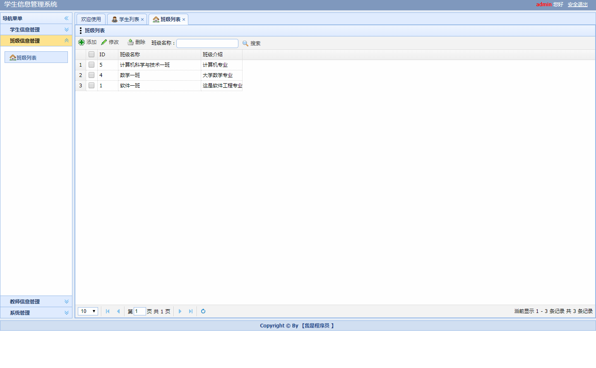
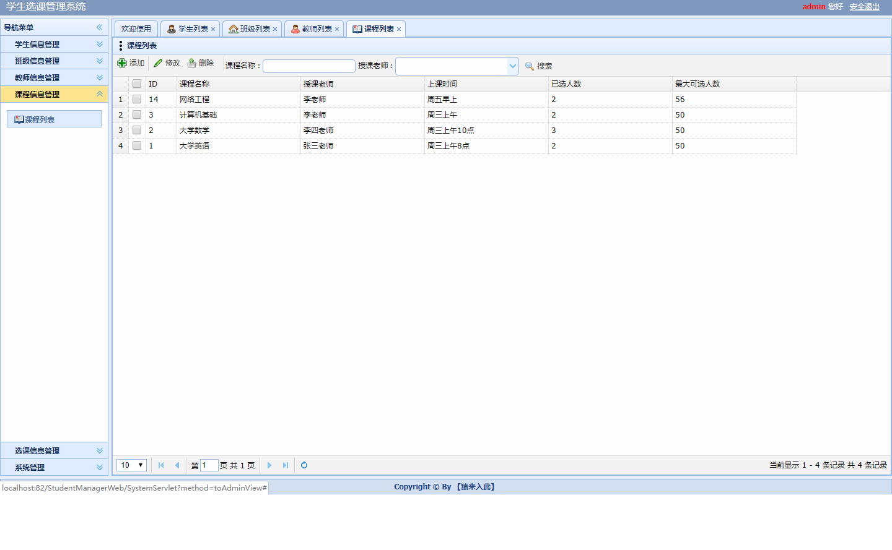

通过javaEE学生选课管理系统改编的基于ssm框架的选课系统

项目代码已收录公众号【java项目源码】，需要请自行关注一下公众号并下载源码

本系统分为三种权限：

1.学生：登陆后管理自己的信息，可以选课以及推选功能，修改密码

2.教师：学生信息管理（增删改查）,班级信息管理（增删改查）,课程信息管理（增删改查）,选课信息管理（增删改查）,
自己的信息管理以及修改密码

3.管理员：学生信息管理（增删改查）,教师信息管理（增删改查）,班级信息管理（增删改查）,
课程信息管理（增删改查）,选课信息管理（增删改查）以及修改密码
运行项目步骤：

1.项目导入本地后可能会出现红色感叹号，右键项目properties选择java build path修改对应红叉的配置

2.将sql文件导入本地数据库

3.将util下的DbUtil中修改本地数据库连接

CSDN博客地址：[基于ssm框架的选课系统](https://blog.csdn.net/mataodehtml/article/details/118222821)

运行视频地址：[基于ssm框架的选课系统](https://www.bilibili.com/video/BV1wM4y1g7iK)

运行截图：

